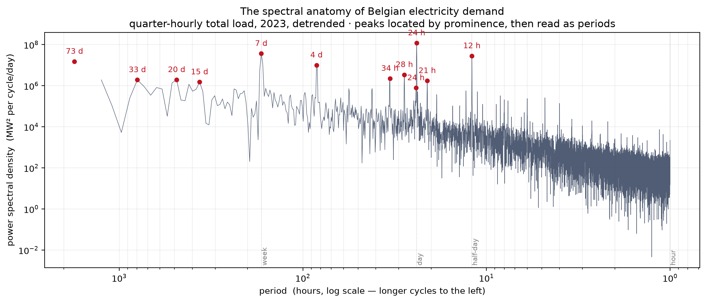

# Electricity Load Forecasting

A reproducible study of probabilistic day-ahead electricity load forecasting for the Belgian power system, using public Elia data.


**The complete point and probabilistic specification was frozen in a Git commit before any result from the confirmation period was scored, and evaluated unchanged on 1 February–31 December 2025.** Every headline comparison carries a cluster-robust uncertainty interval obtained by resampling whole Belgian civil days, and the negative results are reported rather than tuned away.

## Research question

How much of Belgian quarter-hourly electricity demand can be predicted one day ahead from temporal structure and recent load information alone?

And once a point forecast has been made, how well can its uncertainty be quantified?

The project deliberately uses transparent statistical models rather than a large forecasting model zoo. The objective is not to win a retrospective forecasting contest, but to determine what information is genuinely predictive under an operational information boundary.


## Guided Tour

For a concise, illustrated account of the research question, methodology,
untouched confirmation and main findings, see the
[Guided Tour](docs/ElectricityLoadForecasting_Guided_Tour.pdf).

## Forecasting setup

Forecasts are made for every 15-minute period of the following Belgian civil day, using only information available by **18:00 Europe/Brussels on D−1**, matching the issue time given in the ODS001 field metadata, which labels the forecast column *Day-ahead 6PM forecast*.

The modelling sequence is:

1. civil-time persistence benchmarks, including previous week D−7;
2. a Fourier/calendar model for recurring daily and weekly load structure;
3. a leakage-safe recent-level correction using forecast errors observed during the preceding 24 elapsed hours;
4. empirical P10–P90 uncertainty intervals based on recent historical forecast residuals for the same Belgian civil hour.

Daylight-saving transitions, holidays, missing observations and forecast availability are handled explicitly.

## Spectral structure of Belgian demand

Before any model was fitted, the realised load series was decomposed by periodogram. Spectral peaks were located by prominence and only then read as periods, so the daily and weekly cycles were found in the data rather than assumed.



The dominant resolved components are the 24-hour cycle (23.2% of resolved spectral density), a 7.02-day component (7.1%) and the 12-hour harmonic (5.5%). The weekly period appears at 7.02 rather than exactly 7 days because 365/7 is not an integer: the weekly cycle falls between frequency bins and its power is spread across neighbours. Three missing observations were filled to obtain the gapless uniform grid the transform requires. The selected component set was stable under an independent check that substituted the value one week earlier instead of interpolating. A second check, recomputing the spectrum without a Hann window, did not reproduce the same component set; that check is reported as not reproducing the result rather than as a successful confirmation. Such a difference is consistent with spectral leakage from periodic components that fall between frequency bins, but that is an interpretation of the discrepancy, not something the check established.

The spectrum is a variance decomposition, not a statement about predictability. It motivated the harmonic *periods* used later, but not the harmonic *counts*, which were fixed a priori as the first four harmonics of the day and the first three of the week. Selecting frequencies from a spectrum estimated over the whole evaluation year would have leaked that year into the model specification.

## Untouched confirmation

Model development used data before the final confirmation period.

The complete point and probabilistic specification was then **frozen in Git before any untouched 2025 confirmation result was scored**. January 2025 had already been encountered during development and was therefore excluded from untouched claims.

The frozen method was subsequently evaluated, unchanged, on **1 February–31 December 2025**: 334 civil days and 32,064 quarter-hour slots, including the 92-slot and 100-slot daylight-saving days.

Point forecasts are scored on a common sample of **32,060 slots**. The four excluded slots are 02:00–02:45 civil time on 2025-04-06, where the D−7 benchmark has no source observation because its source day was the spring-forward transition, on which those civil times did not exist. Those four slots were removed from *every* model, so no model is scored on a larger sample than another.

### Point forecasts

| Forecast | MAE (MW) |
|---|---:|
| Previous week (D−7) | 438.9 |
| D−7 + identical recent-level correction | 423.0 |
| Fourier/calendar | 501.1 |
| **Fourier/calendar + recent level** | **315.4** |
| Elia day-ahead | 277.7 |

The frozen model improved MAE by **25.4%** relative to the information-matched D−7 benchmark receiving the identical recent-level correction.

A seven-day moving-block bootstrap over complete Belgian civil days, with 2,000 replicates, gave a 95% interval of **18.8% to 32.0%** for that improvement.

This control is important. Adding recent-level information to D−7 improves MAE only from 438.9 to 423.0 MW, whereas combining recent level with the structural Fourier/calendar forecast reduces it to 315.4 MW. The result therefore supports complementary predictive value from recurring load shape and recent load level, rather than attributing the gain to recency alone.

Elia's operational forecast nevertheless remained better. The frozen model's MAE was **13.6% higher**, with a 95% block-bootstrap interval of **5.9% to 21.5%**.

Elia's operational forecast may draw on information that is unavailable to this deliberately load-history-only model. It is therefore used as an operational reference point rather than as a like-for-like competitor, and the comparison is best read as an indication of how much day-ahead predictability is reachable from the load history alone.

Bootstrap intervals are reported for the ratios, which are the quantities being compared. The MAE levels in the table above are point estimates and carry no interval.

## Probabilistic forecasts

The frozen empirical-residual P10–P90 forecasts, evaluated on all 32,064 confirmation slots, produced:

| Forecast | Coverage | Mean width (MW) | Mean pinball loss (MW) |
|---|---:|---:|---:|
| Frozen empirical residuals | 0.765 | 941.9 | 74.19 |
| Elia day-ahead | 0.758 | 836.1 | 66.09 |
| Nominal | 0.800 | — | — |

The 95% seven-day block-bootstrap interval for frozen-model coverage was **0.725–0.800**. The confirmation therefore does not establish that aggregate coverage differs from the nominal 80%.

Nor was aggregate coverage distinguishable from Elia's. The paired difference was **+0.007**, with a 95% block-bootstrap interval of **−0.033 to +0.042**.

The complete frozen quantile forecasts did differ from Elia in width and quantile loss:

- mean interval width was **12.7% higher**, with a 95% interval of **+5.8% to +20.1%**;
- mean pinball loss was **12.3% higher**, with a 95% interval of **+3.5% to +22.4%**.

These differences should not be attributed to interval construction alone. The frozen point forecast itself had 13.6% higher MAE than Elia, and the experiment cannot determine how much of the wider intervals and higher pinball loss results from that less accurate underlying point forecast rather than from the empirical-residual uncertainty method.

## Conditional calibration

Season and day type were specified as conditional reporting dimensions before the untouched confirmation was opened.

Frozen-model seasonal coverage was:

| Season | Coverage | 95% block-bootstrap interval |
|---|---:|---:|
| DJF | 0.824 | 0.728–0.899 |
| MAM | 0.779 | 0.708–0.852 |
| JJA | 0.792 | 0.734–0.848 |
| SON | 0.684 | 0.611–0.746 |

DJF contains February and December only because January 2025 was excluded by the pre-confirmation protocol.

SON was the only pre-specified seasonal/day-type cell whose ordinary 95% block-bootstrap coverage interval excluded nominal 80% coverage. This is treated as a **conditional diagnostic, not as a multiplicity-adjusted confirmatory finding**.

The holiday estimate is based on only **9 civil days** and is therefore reported as too imprecise for a substantive holiday-effect claim.

Hour-of-day calibration is retained as a descriptive diagnostic; individual hours are not selected for inferential claims.

## What the experiment found

The Fourier/calendar model by itself was not competitive. Regular periodic structure is therefore not sufficient for good day-ahead forecasting.

Its predictive value became apparent when combined with a leakage-safe estimate of the current load level. Applying the identical level correction to weekly persistence produced only a small improvement, while the structural model plus recent level produced a substantial and confirmed reduction in forecast error.

The probabilistic result is more cautious. Aggregate coverage of the frozen empirical intervals cannot be distinguished from nominal coverage or from Elia's coverage in this confirmation period. The frozen quantile forecasts were wider and had higher pinball loss than Elia's, but the experiment does not isolate interval construction from the quality of the underlying point forecast.

The study therefore identifies both **where a simple transparent forecast obtains useful predictive information and where the available experiment no longer supports a causal attribution**.

## Methodological safeguards

Temporal integrity is treated as part of the model rather than as a cleanup step.

- Belgian civil time is modelled explicitly, including 92-, 96- and 100-slot days.
- Forecasts cannot use observations beyond their stated forecast origin.
- Missing observations are not silently imputed for scoring.
- Baselines and candidate models are compared on common samples.
- Positive and negative leakage controls test the information boundary.
- An information-matched D−7 control receives the same recent-level correction as the structural model.
- The final 2025 confirmation specification was frozen in Git before its outcomes were opened.
- January 2025, having been encountered during development, is excluded from untouched claims.
- Post-confirmatory uncertainty analysis resamples complete civil days in seven-day moving blocks.
- Bootstrap comparisons are paired: every model is evaluated on the same resampled days within each replicate.
- Negative results are retained rather than tuned away.

The non-circular moving-block bootstrap uses all consecutive seven-day blocks available within the confirmation period. Consequently, observations near the beginning and end of the period occur in fewer candidate blocks than observations in its interior. No post-confirmatory recalculation was made to remove this minor boundary effect.

## Data provenance

The historical Elia data were retrieved and cached during notebook execution. The confirmation pull covers 1 October 2024 to 31 December 2025, of which 1 February–31 December 2025 is the scored confirmation period and the remainder supplies the estimation and residual history the frozen procedure requires. The exact acquisition timestamp was not recorded and cannot be reconstructed after the fact.

Elia revises historical load values. A subsequent retrieval may therefore produce figures that differ slightly from those reported here. The reported quantities are stable at the level of the conclusions drawn, but not to the last decimal.

## Repository

    notebooks/probabilistic_forecasting.ipynb   complete research narrative
    src/electricity_load_forecasting/           reusable forecasting and validation code
    tests/                                      automated tests
    figures/                                    generated diagnostic figures

The notebook contains the empirical argument and dataset-specific audits. Reusable behaviour is implemented in the package and covered by tests.

## Running the project

```bash
pip install -e ".[dev]"
pytest
jupyter lab notebooks/probabilistic_forecasting.ipynb
```

The notebook retrieves Elia Open Data dataset `ods001` and caches source data locally under `cache/`; downloaded data are deliberately not committed.

## Companion repository

[ElectricityResourceAdequacy](https://github.com/evrelegh/ElectricityResourceAdequacy) studies Belgian generation adequacy (LOLE and EENS) on the same Elia and ENTSO-E data, using the Fourier transform for a different computational purpose: convolving independent random variables into an aggregate capacity distribution, rather than decomposing a time series into periodic components. It is offered as a related study of the same power system, not as methodological evidence for the forecasting results reported here.

## Data source

Public **Elia Open Data**, dataset `ods001`: measured and forecast total load for the Belgian control area.
